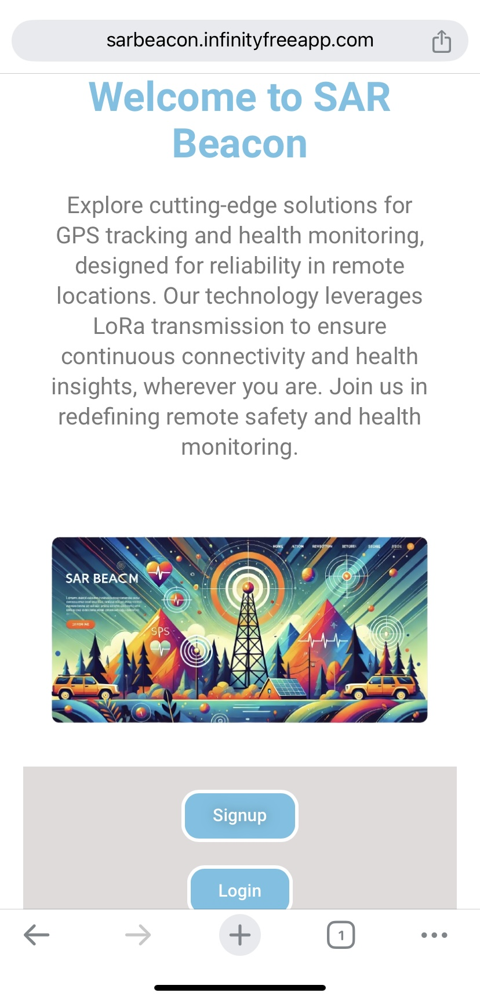

# 🚨 SAR Beacon – IoT-Based Search and Rescue System

**Final-Year Project | BSc in Electronics and Automation | University of Colombo**

SAR Beacon is an advanced IoT-based solution developed to assist in emergency search and rescue operations. By integrating real-time location tracking, health monitoring, long-range communication, and automated alerts, this system ensures faster, data-driven responses in life-critical scenarios.

---

## 🔍 Key Features

- 📍 **GPS Tracking**  
  Real-time location updates help pinpoint the exact position of individuals in distress.

- ❤️ **Health Monitoring (MAX30100)**  
  Tracks heart rate and blood oxygen levels to monitor the user's condition remotely.

- 📲 **Emergency Alerts via GSM (SIM7600)**  
  Sends critical SMS alerts to rescue teams or predefined contacts during emergencies.

- 📡 **LoRa Communication**  
  Enables reliable long-range, low-power communication in areas without mobile coverage.

- ☁️ **Cloud Connectivity with Firebase**  
  Centralized data storage, live monitoring, and real-time notifications for decision-makers.

- 📱 **Web & Mobile Interfaces**  
  Accessible dashboards through a responsive website and Android app for live data visualization and alerts.

---

## 🧠 Technology Stack

| Component        | Details                                      |
|------------------|----------------------------------------------|
| Microcontroller  | ESP32                                        |
| Sensors          | MAX30100 (Heart rate, SpO2)                  |
| GSM Module       | SIM7600                                      |
| Communication    | LoRa (SX1278)                                |
| Cloud Platform   | Google Firebase                              |
| Mobile App       | Android Studio (Java)                        |
| Frontend         | HTML, CSS, JavaScript                        |

---

## 🗂️ Repository Structure


SAR-Beacon/<br>
├── **Arduino_Code/** &nbsp;&nbsp;&nbsp;&nbsp;&nbsp;&nbsp;&nbsp;&nbsp;&nbsp;&nbsp;&nbsp;&nbsp;&nbsp;&nbsp;&nbsp;&nbsp;&nbsp;&nbsp;&nbsp;[ESP32 source code (.ino files)]<br>
├── **Mobile_App/** &nbsp;&nbsp;&nbsp;&nbsp;&nbsp;&nbsp;&nbsp;&nbsp;&nbsp;&nbsp;&nbsp;&nbsp;&nbsp;&nbsp;&nbsp;&nbsp;&nbsp;&nbsp;&nbsp;&nbsp;&nbsp;&nbsp;&nbsp;[Android Studio project]<br>
├── **Website/** &nbsp;&nbsp;&nbsp;&nbsp;&nbsp;&nbsp;&nbsp;&nbsp;&nbsp;&nbsp;&nbsp;&nbsp;&nbsp;&nbsp;&nbsp;&nbsp;&nbsp;&nbsp;&nbsp;&nbsp;&nbsp;&nbsp;&nbsp;&nbsp;&nbsp;&nbsp;&nbsp;&nbsp;&nbsp;[Web dashboard (HTML/CSS/JS)]<br>
├── **Datasheets/** &nbsp;&nbsp;&nbsp;&nbsp;&nbsp;&nbsp;&nbsp;&nbsp;&nbsp;&nbsp;&nbsp;&nbsp;&nbsp;&nbsp;&nbsp;&nbsp;&nbsp;&nbsp;&nbsp;&nbsp;&nbsp;&nbsp;&nbsp;&nbsp;[Component datasheets (PDF)]<br>
├── **Screenshots/** &nbsp;&nbsp;&nbsp;&nbsp;&nbsp;&nbsp;&nbsp;&nbsp;&nbsp;&nbsp;&nbsp;&nbsp;&nbsp;&nbsp;&nbsp;&nbsp;&nbsp;&nbsp;&nbsp;&nbsp;&nbsp;&nbsp;[Images of UI, hardware, alerts]<br>
├── **Docs/** &nbsp;&nbsp;&nbsp;&nbsp;&nbsp;&nbsp;&nbsp;&nbsp;&nbsp;&nbsp;&nbsp;&nbsp;&nbsp;&nbsp;&nbsp;&nbsp;&nbsp;&nbsp;&nbsp;&nbsp;&nbsp;&nbsp;&nbsp;&nbsp;&nbsp;&nbsp;&nbsp;&nbsp;&nbsp;&nbsp;&nbsp;&nbsp;&nbsp;&nbsp;[Reports, documentation]<br>
├── **LICENSE** &nbsp;&nbsp;&nbsp;&nbsp;&nbsp;&nbsp;&nbsp;&nbsp;&nbsp;&nbsp;&nbsp;&nbsp;&nbsp;&nbsp;&nbsp;&nbsp;&nbsp;&nbsp;&nbsp;&nbsp;&nbsp;&nbsp;&nbsp;&nbsp;&nbsp;&nbsp;&nbsp;&nbsp;&nbsp;&nbsp;[Project license (MIT recommended)]<br>
└── **README.md** &nbsp;&nbsp;&nbsp;&nbsp;&nbsp;&nbsp;&nbsp;&nbsp;&nbsp;&nbsp;&nbsp;&nbsp;&nbsp;&nbsp;&nbsp;&nbsp;&nbsp;&nbsp;&nbsp;&nbsp;&nbsp;&nbsp;&nbsp;[Project overview and instructions]


---

## 📸 Screenshots

### Hardware Prototype


### Live Monitoring Dashboard


---

## 🚀 Getting Started

### ✅ Prerequisites

- Arduino IDE (with ESP32 board installed)
- Android Studio
- Firebase Project with Realtime Database
- SIM card with SMS service (for SIM7600)
- LoRa transceivers (e.g., SX1278)

### 📦 Setup Instructions

1. **Clone this repository**
   ```bash
   git clone https://github.com/kanishkaIG/SAR-Beacon.git

2. **Configure Arduino Code** <br>
Navigate to Arduino_Code/ and open the .ino file in Arduino IDE. <br>
Update with your WiFi credentials, Firebase URLs, and device parameters.

3. **Deploy Mobile App** <br>
Open the Mobile_App/ folder in Android Studio. <br>
Connect an Android device or emulator and run the project.

4. **Launch Web Interface** <br>
Open Website/index.html in a browser locally or deploy via Firebase Hosting or GitHub Pages.

### 📜 License

This project is licensed under the MIT License — you’re free to use, modify, and share it with attribution.

### 🙏 Acknowledgements

Department of Electronics and Automation, University of Colombo <br>
My academic supervisors and peers for their continued guidance and support

### 💬 Feedback & Contributions
Suggestions, feedback, and contributions are welcome! <br>
Feel free to open an issue or submit a pull request.

### 🔗 Connect with Me

LinkedIn: https://www.linkedin.com/in/kanishka-isuru-gangulal-8b8746154/ <br>
Email: d.kanishkaisurugangulal@gmail.com

---
